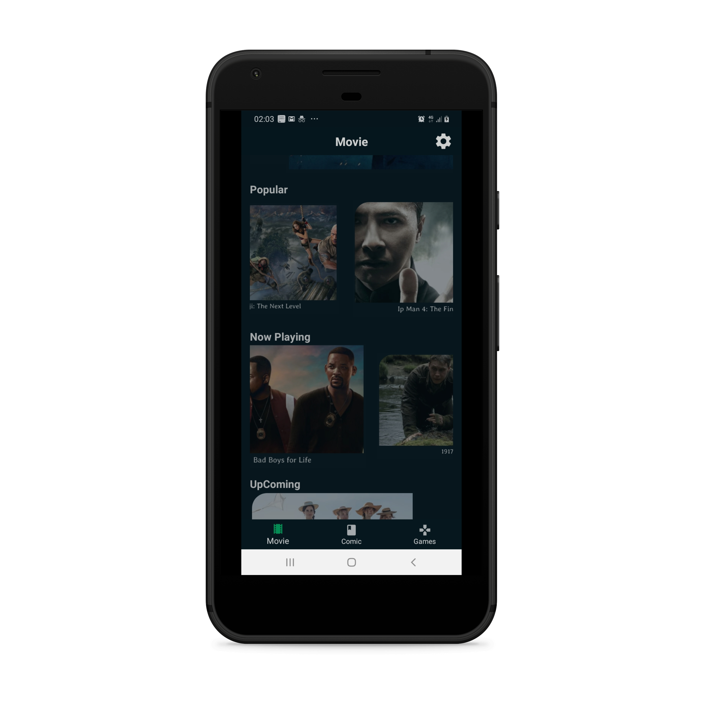

# eBox
## Project Overview
This app shows collections of movies and comics, as well as a short quiz trivia 
It shows the top rated, popular, upcoming, now playing movies from the IMDB movies including a clip of the current trailer.  
The Api Service provider are MovieDB, Marvel Comic , Rapid Api for the trivia.
The movies section gives you information about movies from the TMDb.Such as the popular, top rated, now Playing and upcoming movies. 
The comic section dives you information about the comics available from Marvel.
The trivia is a quiz that randomly generate question from different categories sport, games, movies to politics

## Libraries 

- [Android Architecture Components](https://developer.android.com/topic/libraries/architecture/) 
    * [Room](https://developer.android.com/topic/libraries/architecture/room)
    * [ViewModel](https://developer.android.com/topic/libraries/architecture/viewmodel)
    * [LiveData](https://developer.android.com/topic/libraries/architecture/livedata)
- Dependency Injection: Dagger
- Retrofit for REST api communication
- Glide for image loading
- Reactive Extension RxJava

## Screenshot

